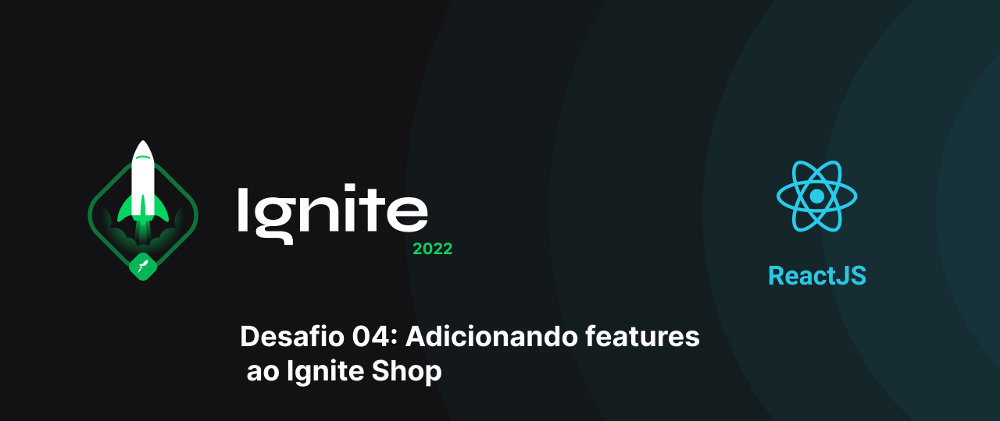

This repository contains the resolution of 4th project: Adding features to the Ignite Shop from the react js course by rocketseat. In this challenge, a to-do list was developed using reactjs. In this challenge, a shopping cart was implemented in the project, with the option to add and remove items before proceeding to checkout in the Stripe api.

